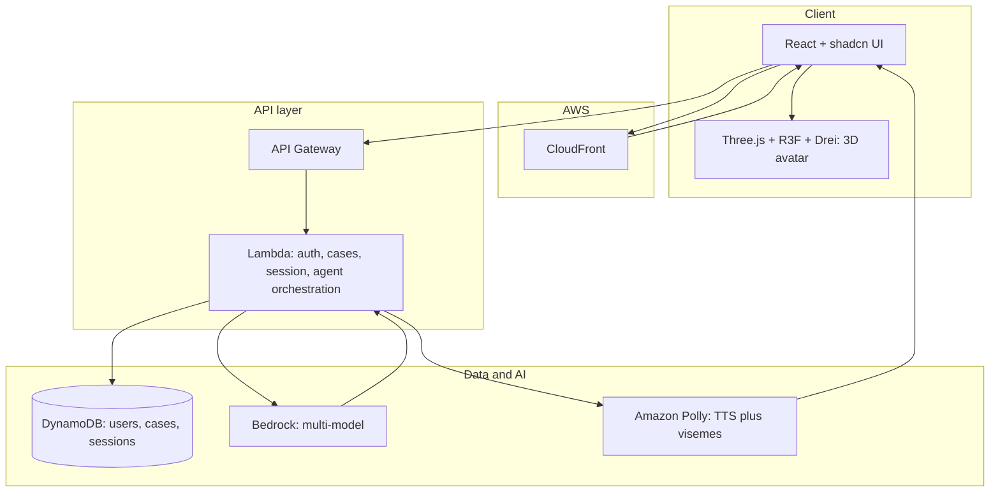
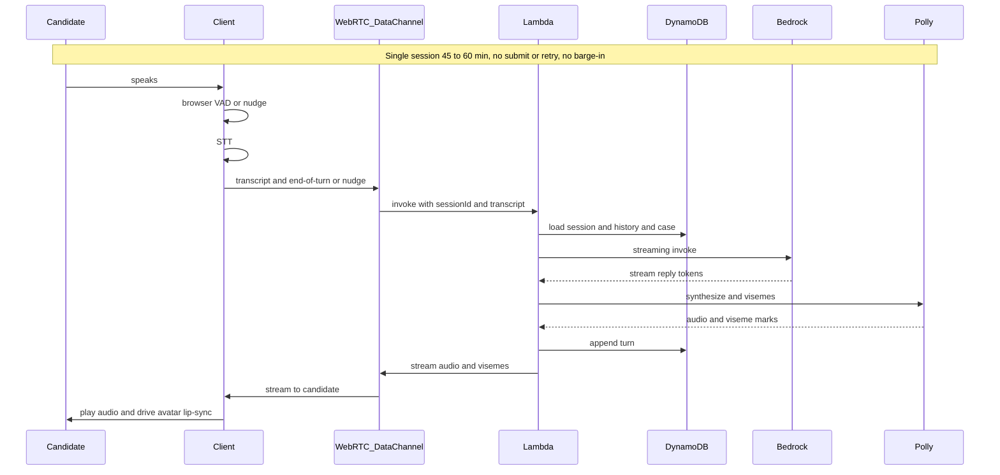

# Case.ly: Architecture

## 1. Voice and avatar

**Voice — Amazon Polly:** All text-to-speech via Polly. Backend requests **audio** and **viseme speech marks** (`SpeechMarkTypes: ['viseme']`) with the same voice; Polly returns time-aligned viseme events that drive lip-sync on the 3D avatar. Map Polly visemes to the 3D model’s mouth morph targets. [Polly visemes](https://docs.aws.amazon.com/polly/latest/dg/viseme.html). Pricing: e.g. Standard $4/1M chars, Neural $16/1M chars.

**Avatar — Three.js, React Three Fiber, Drei:** Digital human avatar rendered in-browser. Use a humanoid with **morph targets** (e.g. Ready Player Me, VRM, glTF with face morphs). Frontend receives Polly audio + viseme timeline; plays audio and sets mouth morph target weights at each viseme timestamp. Optional expression morphs (e.g. listening vs speaking). Rendered in a Canvas (R3F) inside the React app. No third-party avatar API.

---

## 2. LLM: Amazon Bedrock

All LLM calls via **Amazon Bedrock**. **ConsultingInterviewerAgent** uses different Bedrock models per sub-task (e.g. Haiku for routing, Sonnet for reply generation). Single agent implementation; case content loaded from DynamoDB and injected into prompts—no case-specific code paths.

---

## 3. High-level architecture

- **Auth:** Cognito (user pools); JWT in API Gateway/Lambda.
- **Backend:** REST for auth and session setup; **WebRTC** for the 45–60 min interview (data channel + optional audio). Signaling (REST or WebSocket) establishes the peer connection; per-turn Lambda runs agent (Bedrock → Polly) and streams audio+visemes over WebRTC. Session and conversation history in DynamoDB.
- **Database:** DynamoDB (NoSQL) is the **authoritative** store for users, cases, **sessions**, and **conversation turns**. Session state (turns, exhibitsGiven, phase, etc.) lives in DynamoDB; any client-side copy is **only a cache** (see 7.6). Users (or Cognito-only); cases (6.1); sessions (sessionId, userId, caseId, exhibitsGiven[], status, …); turns (sessionId + turnIndex); feedback. The person in the interview is the **candidate**.
- **Voice:** Polly TTS + viseme speech marks; client playback and lip-sync.
- **Avatar:** In-browser Three.js + React Three Fiber + Drei; 3D humanoid with morph targets; Polly visemes drive mouth; optional expression morphs.
- **Loading:** Loading screen from case selected until avatar model and first agent response (or Polly audio) are ready.

---

## 4. Terraform (IaC)

- **Modules:** `cognito`, `api_gateway`, `lambda`, `dynamodb`, `bedrock` (if needed). Polly and Bedrock use IAM; no third-party avatar secrets.
- **Environments:** `dev`, `staging`, `prod` (separate state, env-specific vars).
- **Concurrency:** Stateless Lambda + DynamoDB; Polly and Bedrock scale on demand.

---

## 5. Frontend (React + shadcn)

- **Auth:** Cognito Hosted UI or Amplify Auth; protected routes.
- **Screens:** Login/signup, case list (from API), case loading, interview (avatar + chat/voice + optional transcript). Interview UX: continuous conversation; **no submit or retry button**—the candidate speaks as if with a human interviewer. A **nudge** button in the corner of the interviewer (avatar) acts as a failsafe to signal “it’s the AI’s turn” when browser VAD does not fire.
- **UI:** shadcn as base; modern, minimal layout. **Interview layout:** Familiar video-conferencing style (e.g. Google Meet). **When no exhibit is shared: avatar full screen** (main area = interviewer avatar only; optional self-view tile and controls bar). When an exhibit is shared: show exhibit (slide from casebook via assetUrl) in the shared area and avatar in a smaller tile or split. **Controls bar:** mute, nudge, **Leave** (pause session and disconnect; can resume later), optional **End interview** (close session). Optional transcript panel. Clean, recognizable so the candidate feels in a “call.”
- **Resume flow:** Dashboard or “My interviews” lists the candidate’s sessions (including **incomplete**: status `active` or `paused`). **Resume** opens the same session (same sessionId); client re-establishes WebRTC and continues from last turn (section 7.8).
- **Avatar:** In-page Canvas with React Three Fiber (Three.js + Drei); 3D humanoid (e.g. Ready Player Me, VRM); lip-sync from Polly viseme timeline; optional expression morphs; case-agnostic. Nudge button placed in corner of avatar area (failsafe for turn-taking).

---

## 6. One agent, any case

- **Case storage:** DynamoDB: `caseId`, `title`, `context`, `promptAdditions`, `difficulty`, etc. (See section 6.1 for full case and exhibit schema from sample cases.)
- **Agent:** The **platform** invokes the agent via a **stable interface** (section 6.3): platform loads session and case, passes candidate turn + context into the agent; agent returns `replyText` and optional `exhibitIndex`, `phase`, `metadata`. Platform then persists, calls Polly, streams to client, and displays exhibit if needed. The **agent is a separate, replaceable module or service** so the platform can start with a basic agent and upgrade it later without changing platform code.

---

### 6.1 Case and exhibit data model (from case samples)

Based on the **Columbia 2017**–style case pack (e.g. Alkaline Ash, Boston Office Supplies, California Parking Lot), the following structure supports interviewee-led and question-led cases with exhibits.

**Cases table**

- **PK:** `caseId` (e.g. UUID). **Attributes:** `title`, `problemStatement` (narrative), `caseNotes` (object: `industry`, `caseType`, `firm`, `conceptsTested[]`, `structure`, `creativity`, `math` — difficulty levels), `interviewStyle` (`interviewee_led` | `question_led`), `guidanceForInterviewer` (text), `clarificationAnswers` (map or JSON: Q → A for when candidate asks), `sampleFramework` (text or structured), `conclusion`, `rationale`, `recommendation`, `nextSteps`, `risks` (all optional, for agent reference or eval). Optional: `promptAdditions`, `difficulty` (overall).

**Exhibits (per case)**

- **Option A — Embedded in case item:** Attribute `exhibits: [ { exhibitIndex, title, content, contentType, analysis } ]`. `content` = data shown to the candidate (see below). `analysis` = interviewer-only notes (what a good candidate should notice; correct numbers; redirects); agent uses this, candidate never sees it.
- **Option B — Separate table:** PK `caseId`, SK `exhibit#<index>` (e.g. `exhibit#1`). Attributes: `title`, `content`, `contentType`, `analysis`. Keeps case item smaller; same access pattern (get case + get exhibits by caseId).

**Exhibit content structure**

- Each exhibit is represented by a **single asset URL** pointing to the **slide from the casebook** that contains that exhibit. The candidate sees the same slide as in the case pack; no custom rendering.
- **Per exhibit:** `exhibitIndex`, `title`, `**assetUrl**` (e.g. S3 or CDN URL to the slide image: PNG, WebP). Optional: `analysis` (interviewer-only notes for the agent). Optional: `altText` for accessibility.
- **Units and context:** Where relevant (e.g. “metric tons”), keep in the case’s `guidanceForInterviewer` or clarification answers so the agent can state them when handing the exhibit.

**Questions (question-led cases)**

- For cases with a fixed question flow (e.g. Boston Office Supplies Q1, Q2; California Parking Lot Q1–Q5): store `questions: [ { questionIndex, questionText, solution (points for discussion), exhibitToGive (exhibit index or null), redirectOrHint } ]` in the case item or in a separate item with PK `caseId`, SK `question#<index>`. Agent uses this to know what to ask next and when to hand an exhibit.

**Session/agent state (including exhibits)**

- **Session record:** As in 7.6: `sessionId`, `userId`, `caseId`, `createdAt`, `endedAt`, `status`, optional `connectionId`.
- **Conversation history:** Per 7.6 (turns keyed by `sessionId` + `turnIndex`). Each turn: `role`, `content`, `timestamp`, optional `messageId`.
- **Exhibit state:** Track which exhibits have been “given” to the candidate in this session so the agent (and UI) stay consistent. **Option A:** Attribute on session item: `exhibitsGiven: number[]` (list of exhibit indices). **Option B:** Include in each assistant turn when an exhibit is given: e.g. `metadata: { exhibitGiven: 1 }`. Agent loads session + last N turns + `exhibitsGiven`; when the agent decides to hand Exhibit 2, backend appends to `exhibitsGiven` and sends a **display exhibit** event to the client (see 6.2).
- **Current question (question-led):** Optional `currentQuestionIndex` on session; agent advances it when moving to the next question (and may hand an exhibit). Alternatively derive from conversation (e.g. “asked Q2” in last assistant turn).

---

### 6.2 Displaying exhibits: “screen sharing” the slide

- **Asset per exhibit:** Each exhibit has an `**assetUrl**` pointing to the **slide from the casebook** (e.g. image exported from the case pack PDF). When the agent hands an exhibit, the backend sends `{ type: "displayExhibit", exhibitIndex, title, assetUrl }` over the WebRTC data channel. The client displays that image in the exhibit area. The candidate sees the same slide as in the casebook.
- **Layout: avatar full screen when no exhibit.** When **no exhibit is being shared**, the **avatar takes the full screen** (main content = interviewer avatar only; optional self-view tile and controls bar). When an **exhibit is shared**, the layout changes so the exhibit is visible: e.g. exhibit in the main or shared area and the avatar in a smaller tile, or a split (avatar one side, exhibit the other). When the exhibit is put away or the session ends, return to **full-screen avatar**. Default = full-screen avatar; exhibit shared = exhibit visible + avatar still on screen in a reduced role.
- **Exhibit area:** A dedicated “shared exhibit” region that is **hidden when no exhibit is active** (so the avatar stays full screen). When `displayExhibit` is received, show this region and render the `assetUrl` (image). Optionally show the exhibit title above the image. When the next exhibit is shared, update to the new assetUrl.
- **Accessibility:** Use `altText` per exhibit for screen readers. Announce when an exhibit is displayed or when returning to full-screen avatar.

### 6.3 Agent–platform separation (modular, replaceable agent)

The codebase must be **architected so the agent can be detached from the platform and modified independently**. Separation of concerns: the **platform** handles the interview experience (session, WebRTC, exhibits, auth, Polly, UI); the **agent** handles only “given this turn and context, what should the interviewer say (and do)?” The platform can start with a **very basic agent** and swap in a more capable one later without changing platform code.

**Contract (interface)**

- **Platform → Agent:** The platform calls the agent with everything needed for one turn. Inputs: `sessionId`, `caseId`, `candidateTranscript`, `conversationHistory` (last N turns), `sessionState` (e.g. `exhibitsGiven`, `currentPhase`, `currentQuestionIndex` if question-led), and **case content** (problem statement, guidance, exhibits metadata, questions). The agent does **not** read from DynamoDB or call Polly itself; the platform loads state and case and passes them in.
- **Agent → Platform:** The agent returns a **single response object**, e.g. `{ replyText: string, exhibitIndex?: number, phase?: string, metadata?: object }`. `replyText` = what the interviewer says (platform sends this to Polly and streams to the client). `exhibitIndex` = if the agent “hands” an exhibit, platform looks up `assetUrl` and sends `displayExhibit`. `phase` = optional phase tag for metrics (platform updates `currentPhase`, `phaseHistory`). `metadata` = optional (e.g. framework grade, intent) for metrics and feedback. The platform does **not** need to know how the agent produced this; it only consumes the contract.
- **Stateless:** The agent is **stateless per invocation**. It does not hold session state between calls; the platform does. Each call is pure: (inputs) → (output). This makes the agent easy to test (mock inputs, assert outputs) and replace (new implementation, same interface).

**Where the agent lives**

- **Option A — Same repo, separate module:** A dedicated **agent** package or directory (e.g. `packages/agent` or `src/agent`) that exports a single entry point, e.g. `runAgent(input): Promise<AgentResponse>`. The rest of the backend (Lambda that handles WebRTC turn-complete, session load, etc.) imports this and calls it. No DynamoDB, Polly, or WebRTC inside the agent module; it only receives structured input and returns structured output. Dependencies: only LLM client (Bedrock), prompt construction, and optional grading logic. The platform Lambda (or WebRTC gateway) owns: load session/case, call `runAgent(...)`, append turn, update session, call Polly, stream to client, send displayExhibit if needed.
- **Option B — Separate service:** The agent runs as a **separate service** (e.g. another Lambda or a container) exposed via an internal API. The platform backend calls `POST /agent/turn` with the same input contract and receives the same response. The agent codebase can then be a **separate repo or sub-repo**, versioned and deployed independently. Same contract; deployment boundary instead of module boundary.

**Implementing a basic agent first**

- **Minimal agent (v0):** Implement the contract with the simplest behavior: e.g. system prompt = case problem + “you are the interviewer”; prompt = last N turns + candidate transcript; single Bedrock call; return `{ replyText: completion }` (no exhibit, no phase, no metadata). This is enough for the platform to run end-to-end: turn → agent → replyText → Polly → client. Exhibits and phases can be added later inside the agent without touching the platform.
- **Upgrading the agent later:** Replace or extend the agent implementation: add multi-model logic, framework grading, exhibit-handing rules, phase tagging, flexible-flow and edge-case handling (sections 7.9–7.11). The **interface** (input shape, output shape) stays the same or is extended with optional fields (e.g. `metadata.grade`). Platform code that calls the agent and uses `replyText`, `exhibitIndex`, `phase` does not change; only the agent package or service changes.

**Configuration**

- **Agent version or type:** Support a configurable agent “flavor” (e.g. env var `AGENT_VERSION=basic` vs `full`, or per-session/tenant) so the platform can select which agent implementation to invoke. Enables A/B testing or gradual rollout of a new agent without redeploying the whole platform.

**Summary**

- **Platform:** Session lifecycle, WebRTC, persistence, Polly, exhibit display, auth. On turn complete: load state → call **agent** (interface) → get `replyText` + optional `exhibitIndex`/`phase`/`metadata` → persist, Polly, stream, displayExhibit. Platform does not contain interviewer logic.
- **Agent:** Single responsibility: (context, turn) → (reply, optional exhibit, optional phase, optional metadata). Implemented in a **detachable module or service** with a **stable contract**. Start with a basic implementation; improve or replace the agent later without changing the platform.

---

## 7. Agent execution infrastructure (interview session)

Interviews last **45–60 minutes**. The **candidate** has a continuous conversation with the AI interviewer: no submit or retry button; interaction is voice-led, like speaking with a human. The agent ingests and produces **streams** of data for the full session.

### 7.1 Session and terminology

- **Candidate:** The logged-in user in the interview screen; referred to as “candidate” in all session and agent semantics.
- **Session:** One interview = one **session** (sessionId, userId, caseId). Session lives 45–60 min; state is persisted in DynamoDB so it survives reconnects and stateless compute.
- **Conversation model:** Turn-based at the application level (candidate speaks → agent responds), but the UI exposes no “Send” or “Retry”; turn boundaries are inferred (e.g. end of candidate speech), not triggered by a button.

### 7.2 Transport: WebRTC for the interview session

Use **WebRTC** for the 45–60 min session to get low-latency, bidirectional streaming and a natural “call” model (like Google Meet).

- **Why WebRTC:** Low-latency data and optional audio/video; native browser support; one **PeerConnection** per session. **Data channel** carries: candidate transcript (and end-of-turn / nudge signals), agent viseme timeline and audio chunks (or URLs). Optional: push agent TTS as an **audio track** on the same connection for minimal latency.
- **Signaling:** Establish the peer connection with a short-lived **REST** or **WebSocket** exchange: client requests “join session” (sessionId), backend returns SDP (and ICE candidates) so the client can create the PeerConnection. After the connection is up, all session traffic (transcript, visemes, audio) flows over WebRTC; signaling can close or stay open for renegotiation.
- **Backend WebRTC:** Backend (or a dedicated service) acts as the “remote peer”: accepts incoming WebRTC connections, receives data-channel messages (candidate turn + transcript, nudge), and sends back agent audio + viseme stream. Implement via a component that speaks WebRTC (e.g. Node with `wrtc`, or a managed service). Per-turn agent logic still runs in Lambda (triggered by messages on the data channel); Lambda returns audio+visemes to the WebRTC gateway, which pushes them to the client over the data channel (or audio track).

**Bidirectional:** One WebRTC PeerConnection per session. Client sends: transcript segments, end-of-turn (from browser VAD or nudge). Server sends: agent audio + viseme stream (and optional transcript). No barge-in: agent speaks one response per candidate turn; candidate cannot interrupt mid-response.

### 7.3 Data flows (streaming in and out)

**Candidate → backend (input):**

- **Candidate speech** → client-side **STT** (browser or device) → transcript. **End-of-turn** is determined by **browser VAD** (Voice Activity Detection): use the **Web Audio API** (or a small in-browser VAD) to detect silence/pause after speech and emit “turn complete”; optionally, the candidate can press the **nudge** button in the corner of the interviewer UI as a failsafe to force “agent’s turn.”
- Transcript (and end-of-turn or nudge) is sent over the **WebRTC data channel** to the backend. Backend buffers candidate input until end-of-turn (or nudge), then triggers the agent for that turn.

**Backend → candidate (output):**

- **Agent reply** via Bedrock (streaming invoke). Reply text → **Polly** (TTS + viseme speech marks). Audio + viseme timeline are sent over the WebRTC data channel (or as an audio track) to the client.
- **Client** plays audio and drives 3D avatar lip-sync from viseme data. Playback starts as data arrives; no submit or play button. **No barge-in:** agent finishes each response before the candidate’s next turn.

### 7.4 Execution model (avoiding long-running process timeouts)

- **Lambda** has a 15-minute max timeout. Use **per-turn invocations**: when the WebRTC data channel delivers “turn complete” (from browser VAD or nudge) plus candidate transcript, the WebRTC gateway (or a Lambda triggered by it) invokes the agent Lambda with (sessionId, candidateTranscript, caseId). Lambda loads session and conversation history from DynamoDB, runs Bedrock (streaming) and Polly, streams audio+visemes back via the WebRTC gateway to the client, and appends the turn to DynamoDB. The **WebRTC connection** is long-lived; the **agent** is stateless per turn.
- **Chosen execution model:** WebRTC for session transport + per-turn Lambda. Signaling (REST or short WebSocket) establishes the PeerConnection; WebRTC data channel (and optional audio track) carries all session traffic. Session and conversation history live in DynamoDB; each Lambda invocation loads state, runs one turn, streams result over WebRTC, saves history. No barge-in: one agent response per candidate turn.

### 7.5 Turn-taking and end-of-turn

- **End-of-turn:** Use **browser VAD** (Web Audio API or a lightweight in-browser VAD) to detect silence after candidate speech and emit “turn complete” so the agent responds. As a **failsafe**, a **nudge** button in the corner of the interviewer (avatar) lets the candidate signal “it’s the AI’s turn” when VAD does not fire (e.g. long pause, quiet speech). No submit or retry button; conversation remains natural.
- **No barge-in:** Agent produces exactly one response per candidate turn and streams it (audio + visemes) to the candidate. The candidate cannot interrupt mid-response; barge-in is out of scope.

### 7.6 Session state and conversation history (structure)

**Where session state lives:** Session state is stored **authoritatively** in **DynamoDB** (server-side). The backend owns the session record, conversation turns, `exhibitsGiven`, phase history, and related metrics. Any session or turn data on the **client** (e.g. in-memory or in localStorage) is **only a cache** for UX (e.g. optimistic display, faster re-render); it is not the source of truth. On **resume**, **reload**, or **reconnection**, the platform loads session and turns from the backend (DynamoDB). Writes (new turn, exhibit given, phase update) go to the backend; the client may update its cache after a successful write.

**Sessions table (or partition):**

- **PK:** `sessionId` (e.g. UUID). **Attributes:** `userId`, `caseId`, `createdAt`, `endedAt`, `lastActivityAt`, `status` (`active` | `paused` | `ended`), optional `connectionId` or WebRTC session id. For metrics (section 7.10): optional `currentPhase`, `phaseStartedAt`, `phaseHistory` (list of `{ phase, startedAt, endedAt }`). Keep session record small; do not embed full message list here. GSI on `userId` + `createdAt` for "list my sessions" and resume.

**Conversation history (turns):**

- **Option A — Separate items (recommended for 45–60 min):** Table (or same table with composite key) keyed by `sessionId` (PK) and `turnIndex` (SK, number). Each item = one turn: `role` (`candidate` | `assistant`), `content` (transcript or reply text), `startedAt`, `endedAt` (or single `timestamp`; use for time-per-turn and phase duration in 7.10), optional `messageId`, optional `metadata` (e.g. framework grade, phase). Agent loads items with `sessionId` and `turnIndex` in range [0, N] (or last N by sort). Supports long conversations without huge single items.
- **Option B — Embedded list:** Single session item with attribute `turns: [ { role, content, timestamp } ]`. Cap list length or total size (e.g. last 50 turns) and trim older turns when appending to stay under item size limit. Simpler reads; less ideal for very long sessions.
- **Access pattern:** “Get session + last N turns” for agent prompt building. “Append turn” after each agent response. Optional: “List sessions by userId” (GSI on `userId` + `createdAt`).

**Case context:** Not stored in the session. Loaded each turn from the **cases** table by `caseId` and injected into the system prompt.

### 7.7 Summary diagram

### 7.8 Graceful exit and resume (leave and come back)

- **Desired behavior:** The candidate can **leave at any time** (interview does not need to be completed) and **come back whenever they like** to continue the same interview. No penalty for exiting mid-case.
- **Leave:** A **Leave** control (e.g. in the controls bar) lets the candidate disconnect. Client closes the WebRTC connection and optionally calls a **pause/leave** API (e.g. `PATCH /sessions/:id` with `status: "paused"`). The backend **persists** the session in DynamoDB: all turns, `exhibitsGiven`, and session metadata are already stored; set `status` to `paused` and `lastActivityAt` to now. Do **not** delete the session or history.
- **Disconnect without explicit Leave:** If the client loses connection (browser close, network drop), the WebRTC gateway or a timeout can update the session (e.g. `status` to `paused`, `lastActivityAt`). Even an abrupt exit preserves state.
- **Resume:** From the app (e.g. dashboard or "My interviews"), the candidate sees a list of their **sessions** (GSI by `userId` + `createdAt`), including **incomplete** ones (`status` = `active` or `paused`). They choose **Resume** on a session; client requests **join session** with the **existing sessionId**. Backend loads the session and full conversation history from DynamoDB; re-establish signaling and a **new WebRTC connection**. The next candidate utterance is appended as the next turn; the agent has full history so the conversation continues from where they left off. Re-join is **idempotent** (same sessionId, no new session).
- **Session lifecycle:** `status`: `active` (in progress), `paused` (candidate left, can resume), `ended` (candidate or system ended). Optionally expire resumable sessions after a period (e.g. 30 days) or allow resume until the candidate explicitly **End interview** (sets `status` to `ended`). **Leave** = pause and allow resume; **End interview** = close for good (optional).

### 7.9 Turn dynamics: thinking pauses and framework grading (from example transcript)

- **Pattern from example (e.g. Rhea Bhagia-style):** The candidate often says they will **take a moment to think** (e.g. "is it okay if I take a couple moments to brainstorm my thoughts") and the **interviewer acknowledges** ("absolutely", "take your time"). After a pause, the candidate delivers a **long turn** (e.g. full framework: market size, financials, risks; or structure for market sizing; or mental math). The agent should **not** interrupt during the pause; it responds briefly to the "may I take a moment?" and then, when the candidate finishes the subsequent turn (framework or math), **understands and grades** that content and responds appropriately (e.g. "let's start with market size", or provide an exhibit).
- **Implementation:** (1) **Short ack turn:** When the candidate's turn is only a request for thinking time (intent or keywords), the agent responds with a **short acknowledgment** (e.g. "Absolutely, take your time") and does **not** treat the next silence as end-of-turn until the candidate speaks again. The **next** end-of-turn (VAD or nudge) after the candidate starts speaking again is the real turn (framework, math, etc.). (2) **Framework grading:** When the candidate delivers a framework (or structure), the agent's reply reflects **understanding** (e.g. summarize) and can **internally grade** it (e.g. separate Bedrock call or classifier) and store the grade in session metadata or metrics for later review/eval. The agent's **spoken** reply is natural (e.g. "that's a good approach, let's start with market size"); grading is for metrics and feedback, not spoken unless desired. (3) **Long candidate turns:** VAD should use a **silence threshold** that allows natural pauses within a long answer (e.g. a few seconds) before emitting "turn complete" so the agent does not cut in mid-framework or mid-math.
- **Summary:** Support "I'll take a moment" to think, agent ack, pause, then candidate delivers framework/structure/math; agent understands, optionally grades, and responds. Persist grades for frameworks/segments for metrics and eval. **Silence without asking:** Support candidates who go **silent right after the prompt** (no "may I take a moment")—see 7.11; do not treat "no speech yet" as turn complete; allow extended initial silence until they speak.

### 7.10 Interview metrics (time per part)

- **Goal:** Track **time taken for each part** of the interview (e.g. intro, framework, market sizing, exhibits, risks, recommendation) for analytics, feedback, and eval.
- **Per-turn timestamps:** Store with each turn `startedAt` and `endedAt` (or `timestamp` for turn start; duration = next turn start minus this turn start). Enables per-turn duration and total session duration.
- **Phases/segments:** Define **interview phases** aligned to the case (e.g. `intro`, `framework`, `market_sizing`, `exhibits`, `risks`, `recommendation`). When the agent transitions to a new phase (e.g. after the candidate delivers the framework and the agent says "let's start with market size"), set on the session: `currentPhase`, `phaseStartedAt`, and append to **phase history** (e.g. `phaseHistory: [ { phase, startedAt, endedAt } ]`) so that "time for framework" and "time for market sizing" etc. can be computed.
- **Where to store:** Session item: `currentPhase`, `phaseStartedAt`, `phaseHistory[]`; or a separate **session_metrics** item (PK `sessionId`, SK `metrics`) with `phaseHistory`, `totalDuration`, and per-phase durations. Use for dashboards, reviewer feedback, and RFT.
- **Phase boundaries:** **Agent-driven** (agent emits a structured field or side-channel "phase: market_sizing" when it moves the conversation) or **heuristic** (e.g. first candidate turn after intro = framework; first exhibit given = exhibits phase). Prefer agent-driven or case-question flow so phases match the case structure.

### 7.11 Edge cases and flexible flow (non-standard patterns, silence, novices)

The agent must **navigate edge cases seamlessly** and support **students who don’t know how to case** (performance may be poorer, but the interview should still run and be useful).

**Non-linear or unexpected flow (candidate doesn’t follow the “pattern”)**

- **Design principle:** The agent is **content- and intent-driven**, not script-driven. It does **not** assume a fixed sequence (e.g. “clarify → ask for info → ask for moment → framework”). It infers **what the candidate is doing** from each turn and responds appropriately.
- **Examples:** (1) **Candidate jumps straight to a framework** after the case prompt (no clarification, no “may I take a moment”). The agent should **recognize** that the turn is a framework (e.g. via prompt instructions or a lightweight intent step), **acknowledge and grade it** as in 7.9, and move the conversation forward (e.g. “Thanks for laying that out—let’s dig into market size first”). (2) **Candidate skips clarification** and dives into math. Agent accepts it, uses the math, and can optionally offer clarification later if needed. (3) **Candidate jumps between topics** or gives a very unstructured answer. Agent should **extract what it can** (e.g. one or two sensible threads), respond to that, and gently steer or offer structure only if helpful—not scold or insist on a “correct” order.
- **Implementation:** System prompt (and any few-shot examples) should explicitly instruct the agent to: **adapt to the candidate’s flow**; recognize frameworks, math, clarifications, and recommendations in any order; avoid rigid “you should do X next”; if the candidate does something unexpected, treat it as valid and respond in a way that keeps the interview going. Optional: a small **intent/segment classifier** (or a Bedrock call) that labels the candidate turn (e.g. “framework”, “clarification”, “math”, “recommendation”, “unclear”) so the agent can choose the right kind of response; the same can be achieved with a well-prompted single model that outputs both reply and optional internal label.

**Silence without asking for a moment**

- **Scenario:** After the agent gives the case prompt, the candidate says nothing (or very little) and just goes **silent** while they think—no “can I take a moment.” The agent should **support this**: do not interrupt with “Are you there?” or a new prompt until the candidate has had a **reasonable time** to think.
- **Implementation:** (1) **Turn-completion logic:** “Turn complete” (and thus “agent should respond”) should be triggered only when the candidate has **produced speech** and then gone silent for the VAD threshold. If the candidate has **not spoken at all** since the agent’s last message (or only said a few filler words), **do not** emit turn complete for an extended period—e.g. allow **30–60+ seconds** of silence after the case prompt before any optional “take your time” nudge, or never prompt and just wait. (2) **Configurable silence threshold:** Use a **long** silence threshold (e.g. 15–30 s) after the agent speaks before considering the candidate “done” with their turn when they have already been speaking; and a **very long** or **infinite** “initial silence” window when the candidate has not yet said anything substantive after the agent’s last message. So: silence after the prompt = “candidate is thinking”; when they eventually speak, that speech is the start of their turn; when they stop (VAD), that’s turn complete. (3) **Optional gentle nudge:** After a very long silence (e.g. 60–90 s) with no speech, the agent may optionally say one short line (“Take your time—when you’re ready, share your thoughts”) and then **wait again** without assuming any structure. Prefer waiting over interrupting.
- **Summary:** Support **immediate silence** after the prompt (candidate thinking); no requirement for “meaningful chat” or “may I take a moment” before a long think. When they do speak, treat that as a valid turn and respond to the content.

**Novice-friendly behavior (students who don’t know how to case)**

- **Principle:** The tool is used by **students who may be new to casing**. Their responses may be unstructured, out of order, or incomplete. The agent should **still support** these interviews: keep the conversation going, respond to what they say, grade and track metrics as best as possible, and avoid making the candidate feel “wrong” for not following a pattern.
- **Agent behavior:** (1) **Accept and adapt:** Treat any reasonable candidate turn as valid—framework-like content, partial math, a question, or a ramble. Respond by acknowledging, extracting useful structure or numbers if present, and suggesting a natural next step (e.g. “We could look at market size next” or “Do you want to walk through the numbers?”). (2) **Avoid rigid correction:** Do not insist on “first give a framework” or “you forgot to clarify.” Optionally offer **gentle guidance** (e.g. “Some people find it helpful to start with market size—want to try that?”) without penalizing. (3) **Metrics and grading:** Still record phases, timings, and framework grades where detectable; for very unstructured turns, grading can be “partial” or “unstructured” for reviewer feedback. The interview remains usable for practice and review even when performance is weaker.
- **System prompt:** Explicitly state that the interviewer should support **all levels of experience**, including candidates who skip steps, go silent, or give unstructured answers; the goal is a **smooth, supportive interview** that still allows evaluation and feedback.

---

## 8. Eval and RLHF

**Human eval:** Performed by **your team** (internal reviewers), not an external workforce. Your team scores model outputs and conversations for quality, case fidelity, and tone.

**Feedback pipeline:** Persist **candidate and reviewer feedback** in DynamoDB or S3. Support feedback on **thought processes** and **multiple aspects** of conversations, not only overall rating:

- **Structured dimensions:** e.g. reasoning quality, clarity of follow-up, case adherence, interviewer tone, structure of questions, handling of candidate answers. Store per dimension (numeric or ordinal) plus optional free-text per dimension.
- **Thought process / reasoning:** Where the agent exposes reasoning (e.g. chain-of-thought or internal notes), allow reviewers to rate or comment on that separately (e.g. “interviewer reasoning quality,” “appropriateness of probe”). Store references to the turn or message and the reasoning snippet being evaluated.
- **Scope:** Feedback can be at session level, turn level, or message level. Suggested schema: `sessionId`, `messageId` or `turnIndex`, `role` (candidate | assistant), optional `reasoningSnippetId`, `dimensions` (map of dimension name → score or text), `freeText`, `reviewerId`, `timestamp`. Use for: supervised fine-tuning datasets, reward/preference data for RFT, and golden sets for automatic eval.

**Bedrock Model Evaluation:** Use Bedrock evaluation jobs with **custom prompt datasets** (up to 1,000 prompts in S3). Inference from base or custom model; results to S3. Your team’s ratings (from the feedback pipeline) can be merged with automatic metrics (e.g. length, format) to compare model versions.

---

### 8.1 Eval infrastructure (detailed)

**Goal:** Run repeatable evals on base and custom models; collect your team’s ratings; store results and feed them into RFT or prompt updates.

**1. Prompt and response datasets (S3):**

- **Prompt dataset:** JSONL or JSON in S3. Each record = one eval example: e.g. `{ "promptId", "sessionContext" (or conversation prefix), "caseId", "expectedBehavior" (optional), "metadata" }`. For interview evals, prompts can be “conversation prefix + next expected turn” or “case + candidate answer + ideal interviewer response.” Max 1,000 prompts per Bedrock eval job; use multiple jobs or sampling for larger sets.
- **Response source:** Either (a) **Bedrock model** (specify model ID; Bedrock runs inference for each prompt and writes outputs to the result location), or (b) **your own responses** (pre-generated and uploaded) for A/B or regression evals.

**2. Running a Bedrock evaluation job:**

- In Bedrock: create an **evaluation job**; select **automatic** and/or **human** evaluation. For **human** evaluation, you define a **work team** (your team’s identities in SageMaker Ground Truth or a private workforce). Configure: prompt dataset S3 URI, response source (Bedrock model or custom), output S3 path, evaluation metrics (automatic: e.g. relevance, toxicity; custom: define rubric).
- **Human evaluation:** Reviewers (your team) receive tasks via a **review UI** (Bedrock/Ground Truth portal or a custom UI that you build). Each task = one or more model outputs to score. Define a **custom rubric** (e.g. 1–5 on “interviewer quality,” “case adherence,” “reasoning clarity”) so scores are consistent. Results are written to S3 (promptId, responseId, scores, reviewer id, etc.).

**3. Custom review UI (optional but recommended):**

- Build a small **review app** (e.g. React) that: (1) lists sessions or eval tasks assigned to the reviewer, (2) shows conversation context + model output (+ optional reasoning snippet), (3) collects scores per dimension (thought process, clarity, structure, case adherence, tone) and free-text, (4) submits to DynamoDB or API that writes to S3 in the format expected by your RFT pipeline. This gives your team a single place to provide “feedback on thought processes and various aspects” and keeps data structured for RFT.

**4. Eval pipeline orchestration:**

- **Trigger:** On a schedule, or after each RFT run, or on-demand. **Steps:** (1) Build or sample prompt dataset (from production logs or curated set) → write to S3. (2) Start Bedrock evaluation job (model A vs model B or base vs custom). (3) When human eval is used, your team completes reviews; results land in S3. (4) Aggregate results (avg scores per dimension, per model) and store in DynamoDB or S3 for dashboards or downstream RFT. Optionally use **Step Functions** to chain “prepare dataset → run job → notify team → collect human results → aggregate.”

**5. Outputs and iteration:**

- Eval outputs in S3: prompt-level and aggregate scores. Compare **base vs custom** model before promoting. Use **human feedback** (dimensions + free-text) to: (a) refine rubrics and prompts, (b) build preference or reward datasets for RFT (see below).

---

### 8.2 Reinforcement fine-tuning (RFT) — detailed steps

**Goal:** Improve the interviewer agent using feedback and evaluations. Bedrock supports **reinforcement fine-tuning** with reward-based learning (RLVR for rule-based rewards, RLAIF for AI-based judges). Data stays in AWS.

**1. Data for RFT:**

- **Option A — From Bedrock API logs:** Enable **model invocation logging** for the agent’s Bedrock calls. Logs contain prompt + completion pairs. Use these plus your **feedback** (sessionId, messageId, dimensions, preference or score) to build (prompt, completion, reward) or (prompt, chosen_completion, rejected_completion) for preference learning.
- **Option B — Uploaded dataset:** Prepare a JSON/JSONL dataset in **OpenAI Chat Completions format** or Bedrock’s required format: each example = conversation or prompt + one or more model responses. For **reward-based RFT**, add a reward value per response (from your team’s ratings or an automated scorer). For **preference (RLAIF)**, provide chosen and rejected responses per prompt; Bedrock can use an AI judge to derive rewards from preferences.

**2. Reward design:**

- **RLVR (rule-based):** Define a **reward function** that scores outputs on verifiable criteria (e.g. format, length, presence of required elements). Good for structured aspects (e.g. “interviewer asked a clarifying question”). Implement as a grader that runs on each completion and returns a numeric reward.
- **RLAIF (AI-based judge):** Use a **separate Bedrock model** as a judge: input = prompt + completion, output = score or preference. Train the judge on your team’s labeled data (e.g. “completion A is better than B” or dimension scores), then use the judge to assign rewards to new (prompt, completion) pairs. Subjective aspects (tone, thought process quality) fit here.
- **Human feedback as reward:** Map your **structured feedback** (dimensions, thought-process ratings) to a single reward per response (e.g. weighted sum of dimension scores). Use these rewards in the RFT job so the model improves on the dimensions your team cares about.

**3. Submitting an RFT job in Bedrock:**

- **Documentation:** [Reinforcement fine-tuning in Bedrock](https://docs.aws.amazon.com/bedrock/latest/userguide/reinforcement-fine-tuning.html). **Supported model:** Currently **Amazon Nova 2 Lite**; more models planned.
- **Steps:** (1) Prepare training data (S3): prompt + completions + rewards, or prompt + chosen/rejected in the required format. (2) In Bedrock console or API: create a **model customization job** with type **reinforcement fine-tuning**. (3) Specify: base model (Nova 2 Lite), training data S3 URI, reward model or reward configuration (RLVR script or RLAIF judge config), output S3 path, IAM role. (4) Submit the job; Bedrock runs training (multiple epochs over the data, updating the policy to maximize reward). (5) On success, **register the resulting model** as a custom model in Bedrock and give it a model ID. (6) Point the **ConsultingInterviewerAgent** at this model ID for inference.
- **Iteration:** Run eval (section 8.1) on the new custom model vs base. If metrics and your team’s feedback improve, promote; otherwise adjust reward design or data and re-run RFT.

**4. Combining with continued pre-training or SFT:**

- For **domain knowledge**, run **continued pre-training** (unlabeled case text, rubrics) first. Then run **supervised fine-tuning** (SFT) on high-quality interview transcripts if desired. Then run **RFT** on top of the SFT (or base) model using your feedback-driven rewards. Order: continued pre-training → SFT → RFT is typical; Bedrock docs specify which base models support each.

---

## 9. Trainable agent and knowledge retention

- **Continued pre-training:** Unlabeled domain data (case library, consulting rubrics, terminology) via [Bedrock model customization](https://docs.aws.amazon.com/bedrock/latest/userguide/custom-models.html).
- **Supervised fine-tuning:** High-quality interview transcripts and feedback; format as prompt/completion pairs.
- **Reinforcement fine-tuning:** See section 8.2: reward design (RLVR/RLAIF), data from API logs or uploaded datasets, human feedback mapped to rewards; submit RFT job in Bedrock; register custom model.
- **Custom model lifecycle:** Train or import custom models, register in Bedrock, point ConsultingInterviewerAgent at custom model ID. Run eval (section 8.1) to compare base vs custom before promoting.

---

### 9.1 Fine-tuning limits on Bedrock; using feedback with non–fine-tunable models

**Can you fine-tune Opus or GPT-5.2 on Bedrock?**

- **No.** In Bedrock, **model customization** (fine-tuning and continued pre-training) is supported only for a fixed set of models. As of the [supported models list](https://docs.aws.amazon.com/bedrock/latest/userguide/custom-model-supported.html): **Claude 3 Opus** and **GPT** (including any “GPT-5.2”) are **not** in that list. You can **invoke** Opus (and other non–fine-tunable models) for inference, but you cannot create a custom fine-tuned or RFT version of Opus or GPT in Bedrock.
- **Models you can fine-tune in Bedrock:** Amazon Nova (Nova 2 Lite, Nova Lite, Nova Micro, Nova Pro, Nova Canvas), Titan Text G1 - Express (and continued pre-training), Titan Image/Multimodal; **Anthropic Claude 3 Haiku**; **Meta Llama 3.1 / 3.2 / 3.3** (various sizes). RFT is currently supported on **Nova 2 Lite**; more may be added.

**Options to use your human-in-the-loop feedback when the primary model is not fine-tunable (e.g. Opus)**

1. **Fine-tune a smaller model and use it as the interviewer**
  Use **Claude 3 Haiku** or **Llama 3.3 70B** (or another Bedrock-supported model) as the interviewer and fine-tune it on your feedback (SFT or RFT as in section 8.2). You get behavior shaped by your team’s feedback; you do not use Opus for the interviewer.
2. **Use feedback to build a reward/critic model (RLAIF)**
  Train a **separate model** (e.g. Haiku or Nova 2 Lite) on your human preference or rating data to act as a **judge**: given (prompt, completion), it outputs a score or preference. Use this judge to assign rewards in an **RFT** job for a **fine-tunable** model (e.g. Nova 2 Lite). So: human feedback → critic model; critic model → RFT for the interviewer model. Opus is not fine-tuned; the interviewer model (e.g. Nova or Haiku) is improved using feedback via the critic.
3. **RAG / dynamic few-shot from feedback**
  Store **high-rated conversations and feedback** in a knowledge base (e.g. DynamoDB or a vector store). At inference time, **retrieve** similar past turns or full conversations that your team rated highly and inject them as **few-shot examples** (or “good interviewer behavior”) into the **context** of the call to Opus. Opus stays frozen but receives “how to behave” from your feedback corpus. Requires a retrieval step and a prompt template that includes retrieved examples.
4. **Prompt engineering and prompt selection**
  **Distill** your team’s feedback into **system prompt** rules, do’s and don’ts, and short examples. Run **A/B tests** (or eval jobs) on different prompt variants; select the prompt that gets the best scores from your team. No model change; feedback improves the prompt used with Opus (or any model).
5. **Use Opus for inference, fine-tune an open model elsewhere**
  If you want Opus-level quality for some tasks but also a **custom** model trained on your feedback: use **Opus via Bedrock** for inference where you don’t need customization. Separately, **fine-tune an open model** (e.g. Llama 3.3 70B) on **SageMaker** or another provider using your feedback data, then **import** that custom model into Bedrock (if supported) or run it in another service and use it as the interviewer. So human feedback trains the open model; Opus remains for other or fallback use.

**Summary:** You cannot fine-tune Opus or GPT-5.2 in Bedrock. You can still use human-in-the-loop feedback by: (a) fine-tuning a supported model (Haiku, Llama, Nova) as the interviewer, (b) training a critic on feedback and using RFT on a supported model, (c) RAG/few-shot from high-rated data into Opus’s context, (d) improving prompts from feedback, or (e) fine-tuning an open model elsewhere and using it as the interviewer.

---

## 10. Docker

- **Frontend:** Dockerfile (build + serve via nginx or Node); `docker compose` service for local dev with hot reload.
- **Backend (local):** Docker Compose service(s) for API (Node/Express or FastAPI) talking to localstack or real AWS via env.
- **Deployment:** ECS Fargate or App Runner for containers; Terraform for ECR, task definitions. Lambda remains option for API/agent.
- **Local setup:** `docker compose up` with `.env.example` for config.

---

## 11. Implementation order

1. Terraform: Cognito, DynamoDB (cases, sessions, feedback), Lambda, API Gateway; ECR/ECS if using containers in AWS.
2. Docker: Dockerfile(s) and docker compose for frontend and backend; document env.
3. Backend: Auth, CRUD cases, **start session** (create or **resume** by sessionId), **pause/leave** (set status paused, lastActivityAt). **Platform–agent separation (6.3):** Per-turn flow: load session/case → call **agent module** (input: turn + context; output: replyText, optional exhibitIndex, phase, metadata) → persist, Polly, stream, displayExhibit. **Agent** implemented as a **separate package or service** with the same interface; start with a **basic agent** (single Bedrock call, replyText only). **Agent execution:** WebRTC; per-turn Lambda; persist turns with **startedAt/endedAt** for metrics. Support **turn dynamics**: short ack for “take a moment to think”, then grade framework/structure when candidate delivers it (section 7.9); **edge cases and flexible flow**—silence without asking, non-linear patterns, novice-friendly (section 7.11). **Phase tracking** for time-per-part metrics (section 7.10). Persist feedback for eval.
4. Frontend: Auth, **case list**, **session list** (with Resume for incomplete sessions). Loading state, interview page. **Interview UI:** Video-conferencing layout; **Leave** and optional **End interview** in controls bar; shared exhibit area (hidden when no exhibit = avatar full screen); display exhibit via assetUrl when received. Browser VAD; WebRTC client. Support **resume** (re-join same sessionId).
5. Voice and avatar: Polly (TTS + viseme speech marks) in backend; Three.js + R3F + Drei 3D avatar with Polly-driven lip-sync and expression morphs.

5b. Case and exhibit data: Ingest case pack (e.g. Columbia-style) into **cases** and **exhibits** (section 6.1); each exhibit = **assetUrl** to the slide from the casebook (image in S3). Backend: on agent “hand” exhibit, append to `exhibitsGiven`, send `displayExhibit` with assetUrl. UI: **no exhibit = avatar full screen**; exhibit shared = show slide + avatar in reduced role.
6. Eval and RLHF: Eval infrastructure (S3 prompt/response datasets, Bedrock evaluation jobs, **review UI for your team** to score outputs and provide feedback on thought processes and dimensions). Feedback pipeline to DynamoDB/S3; reward and dataset prep for RFT (see section 8).
7. Trainable agent: Bedrock continued pre-training or fine-tuning on case/feedback data; register custom model; wire agent; eval base vs custom.
8. Polish: Loading UX, error states, concurrency and rate limits.

---

## 12. Cost (chosen stack)

- **Voice:** Polly — Standard $4/1M chars, Neural $16/1M chars; viseme speech marks for lip-sync. **Avatar:** Open-source (Three.js, R3F, Drei); no per-minute avatar cost.
- **LLM:** Bedrock only; multiple models per agent; single AWS bill.
- **Eval/training:** Bedrock inference for evals; human workforce; RFT and model customization per Bedrock pricing.
- **IaC:** Terraform. **Containers:** ECS Fargate/App Runner as needed.
- **Database:** DynamoDB (users, cases, sessions, feedback).

